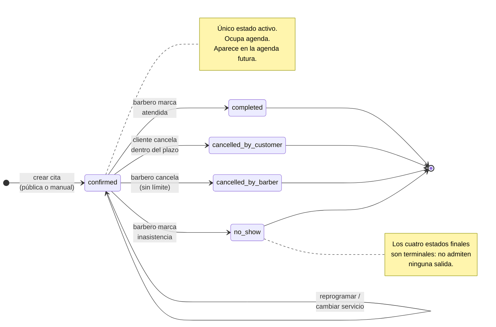
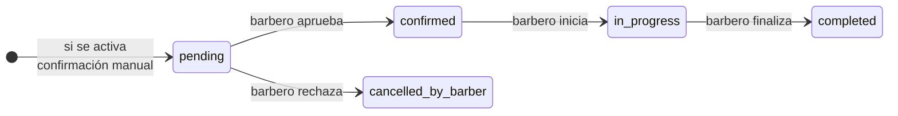

> **Estado del contenido:** Decisión confirmada por `DEC-017`. Los estados, la corrección auditada y el cierre configurable pueden usarse para diseñar la primera migración.

---

## 1. Por qué este documento es crítico

El conjunto de estados determina tres cosas que después son caras de cambiar:

1. **Qué citas bloquean la agenda** — y por tanto qué filas entran en la restricción de la base de datos que impide los cruces (`RN-CON-03`).
2. **Qué puede hacer cada actor** — y por tanto qué comprobaciones de permisos existen.
3. **Qué mide el piloto** — sin un estado que distinga "atendida" de "no asistió", los datos del piloto no distinguen una agenda cumplida de una agenda fallida.

Las reglas `RN-CIT-03`, `RN-CIT-04` y `RN-CIT-05` confirman los estados, las transiciones ordinarias y la operación excepcional de corrección.

---

## 2. Estados confirmados

### 2.1 Criterio de inclusión

Se incluye un estado solo si responde afirmativamente a: *¿existe al menos una decisión operativa o una consulta del piloto que sea imposible sin él?*

| Estado | Incluir | Prioridad | Justificación |
| --- | --- | --- | --- |
| `confirmed` | Sí | P0 | Es el estado en que nace toda cita por `RN-CNF-01`. Sin él no hay agenda. |
| `completed` | Sí | P0 | Distingue lo atendido de lo pendiente. Base de cualquier métrica de uso real. |
| `cancelled_by_customer` | Sí | P0 | `RN-CAN-01` da al cliente la facultad de cancelar. Debe quedar rastro de quién canceló. |
| `cancelled_by_barber` | Sí | P0 | `RN-CAN-03`. Separado del anterior porque la causa y la responsabilidad son distintas. |
| `no_show` | Sí | **P0** | `DEC-017`; necesario para medir el piloto. |
| `pending` | **No** | Futura | Ver 2.3. |
| `in_progress` | **No** | Futura | Ver 2.4. |

### 2.2 Por qué `no_show` es P0

`no_show` se construye antes del piloto por tres motivos:

1. **Costo casi nulo.** Es un estado terminal más, sin efectos sobre notificaciones ni sobre recordatorios. Es un valor en una lista y un botón.
2. **Sin él, los datos del piloto mienten.** Si la única salida disponible es `completed`, el barbero marcará como atendida una cita que no ocurrió, o la dejará sin cerrar. En ambos casos la métrica "citas efectivamente atendidas" queda inservible, y esa métrica es uno de los criterios de éxito del piloto.
3. **La inasistencia es un dolor real del negocio.** Poder cuantificarla es un argumento de venta futuro.

**Estado: Decisión confirmada.** Ver `DEC-017`.

### 2.3 Por qué `pending` queda fuera del MVP

`RN-CNF-01` establece que las reservas pueden aprobarse automáticamente. Con aprobación automática, ninguna cita pasa por un estado de espera: nace confirmada.

`pending` solo tiene sentido si se activa la confirmación manual opcional, clasificada como función futura en [prioridades.md](../01-producto/prioridades.md).

**Consecuencia técnica a tener presente:** cuando `pending` se incorpore, deberá **ocupar agenda**. Si una cita pendiente no bloqueara la franja, dos clientes podrían quedar pendientes por el mismo horario y el barbero tendría que rechazar a uno. Anotarlo ahora evita rediseñar la restricción de la base de datos más adelante.

### 2.4 Por qué `in_progress` queda fuera del MVP

Un barbero que está cortando el pelo no va a tocar su teléfono para marcar "en curso". El estado se quedaría sin usar y sus datos serían poco fiables.

No habilita ninguna decisión: la agenda ya muestra qué cita corresponde a la hora actual. No afecta la disponibilidad, porque la franja ya está ocupada por `confirmed`.

Se reconsiderará si el piloto muestra que el barbero necesita señalar a su siguiente cliente que va con retraso.

---

## 3. Descripción de cada estado

### `confirmed`
La cita está vigente y el barbero la espera. Es el estado inicial de toda cita, tanto pública como manual (`RN-CNF-01`, `RN-CIT-02`).

Ocupa agenda. No es terminal. Es el único estado en el que la cita se considera **activa**.

### `completed`
El servicio se prestó. Lo marca el barbero o el sistema cuando la barbería habilitó el cierre automático (`RN-CIT-05`).

Ocupa agenda. Es terminal.

> Ocupa agenda aunque esté en el pasado: permitir crear otra cita encima de una ya atendida corrompería el historial y falsearía cualquier métrica de ocupación.

### `cancelled_by_customer`
El cliente canceló por su cuenta, dentro del plazo permitido (`RN-CAN-01`) o después del plazo cuando la política configurable lo autoriza (`RN-CAN-02`). El motivo queda registrado cuando la configuración lo exige.

**No** ocupa agenda: la franja vuelve a ofrecerse (`RN-CAN-04`). Es terminal.

### `cancelled_by_barber`
El barbero canceló la cita, en cualquier momento (`RN-CAN-03`). Cubre también la cancelación que el barbero hace a petición del cliente cuando la política no permite cancelación pública fuera del plazo.

**No** ocupa agenda. Es terminal.

> Se mantiene separado de `cancelled_by_customer` porque la distinción importa para el negocio: muchas cancelaciones del cliente indican un problema de compromiso; muchas del barbero indican un problema de operación. Fundirlos en un solo `cancelled` con un campo aparte sería equivalente, pero dos estados explícitos son más difíciles de usar mal.

### `no_show`
La hora pasó y la persona atendida no se presentó. Lo marca el barbero.

**Ocupa agenda.** Es terminal.

> Ocupa agenda por el mismo motivo que `completed`: el tiempo del barbero se consumió igualmente y el registro histórico debe conservarse intacto.

---

## 4. Estados que ocupan agenda

**Estado: Decisión confirmada**

| Estado | ¿Ocupa agenda? | ¿Se resta de la disponibilidad pública? |
| --- | --- | --- |
| `confirmed` | Sí | Sí |
| `completed` | Sí | No aplica (siempre en el pasado) |
| `no_show` | Sí | No aplica (siempre en el pasado) |
| `cancelled_by_customer` | No | No |
| `cancelled_by_barber` | No | No |

### Dos conceptos que no deben confundirse

- **Ocupar agenda** define qué filas entran en la restricción de la base de datos. Es una garantía de integridad y aplica a pasado y futuro.
- **Restarse de la disponibilidad pública** define qué se le muestra al cliente. Solo aplica al futuro, porque el pasado nunca se ofrece.

La regla resultante es simple y fácil de recordar: **una cita cancelada libera el espacio; cualquier otra lo conserva.**

### Consecuencia que conviene aceptar de forma consciente

Si el barbero quiere registrar retroactivamente una cita que se cruza con una ya `completed` —por ejemplo, porque la registró mal—, primero debe cancelar la existente. No podrá crear la nueva encima directamente.

Es una fricción real, pero poco frecuente, y el costo de la alternativa (permitir cruces en el pasado) es mucho mayor: se pierde la garantía uniforme de la base de datos y las métricas dejan de ser fiables.

---

## 5. Diagrama de la máquina de estados

### Estados futuros, para referencia

> Ambos estados están **fuera del MVP**. El diagrama se incluye únicamente para que el modelo de datos no cierre la puerta a incorporarlos.

---

## 6. Transiciones permitidas

| # | Origen | Destino | Actor autorizado | Operación |
| --- | --- | --- | --- | --- |
| T1 | — | `confirmed` | Cliente (público) o barbero | Crear cita |
| T2 | `confirmed` | `confirmed` | Barbero | Reprogramar (cambia el intervalo) |
| T3 | `confirmed` | `confirmed` | Barbero | Cambiar servicio o duración |
| T4 | `confirmed` | `completed` | Barbero o sistema, según configuración | Marcar atendida o cierre automático |
| T5 | `confirmed` | `cancelled_by_customer` | Cliente | Cancelar conforme a la política vigente |
| T6 | `confirmed` | `cancelled_by_barber` | Barbero | Cancelar |
| T7 | `confirmed` | `no_show` | Barbero | Marcar inasistencia |
| T8 | Estado terminal | Estado terminal correcto | Barbero | Corregir una clasificación errónea con motivo |

> **T2 y T3 no cambian el estado.** T8 es una corrección auditada, no una edición del historial ni una reapertura silenciosa.

---

## 7. Transiciones prohibidas

| # | Intento | Resultado | Motivo |
| --- | --- | --- | --- |
| P1 | Cualquier salida ordinaria desde un estado terminal | `409 Conflicto` | Solo T8 puede corregir la clasificación, con permiso y rastro (`RN-CIT-04`). |
| P2 | `cancelled_*` → `confirmed` | `409 Conflicto` | Una cita cancelada no se revive; se crea una nueva. La franja pudo haberse ocupado. |
| P3 | Corrección terminal sin motivo o por un cliente | `403/422` | T8 exige barbero autorizado, motivo e historial. |
| P4 | `confirmed` → `completed` antes de la hora de inicio | `422 No procesable` | No se puede haber atendido una cita que no ha empezado. |
| P5 | `confirmed` → `no_show` antes de la hora de inicio | `422 No procesable` | La inasistencia no puede constatarse antes de tiempo. |
| P6 | Cliente → `cancelled_by_barber` | `403 Prohibido` | Solo el barbero cancela como barbero. |
| P7 | Cliente → `completed` / `no_show` | `403 Prohibido` | Solo el barbero constata lo ocurrido. |
| P8 | Cliente cancela fuera del plazo y la política no lo autoriza | `422 No procesable` | `RN-CAN-01`, `RN-CAN-02`. La respuesta debe explicar la política e indicar que contacte al barbero. |
| P9 | Reprogramar una cita en estado terminal | `409 Conflicto` | Ver P1. |
| P10 | Cualquier transición sobre una cita de otra barbería | `404 No encontrado` | `RN-TEN-01`. Se responde 404, no 403, para no revelar la existencia del recurso. |

---

## 8. Validaciones por transición

| Transición | Validaciones obligatorias |
| --- | --- |
| **T1 — Crear** | Servicio activo y de la misma barbería · duración > 0 · intervalo dentro del horario laboral · sin cruce con citas que ocupan agenda (`RN-CON-01`) · anticipación mínima y ventana máxima para reserva pública; cita manual exenta de ambas (`RN-DIS-04`) · persona atendida presente (`RN-RES-02`) · clave de idempotencia válida (`RN-IDE-01`) |
| **T2 — Reprogramar** | Cita en `confirmed` · nuevo intervalo sin cruce · dentro del horario laboral · nuevo intervalo en el futuro · barbero autorizado sobre esa barbería |
| **T3 — Cambiar servicio o duración** | Cita en `confirmed` · servicio activo y de la misma barbería · el intervalo resultante no se cruza con otras citas · sigue dentro del horario laboral |
| **T4 — Completar** | Cita en `confirmed` · `starts_at` ya pasó · si actúa el sistema, modo automático habilitado y demora X cumplida |
| **T5 — Cancelar (cliente)** | Cita en `confirmed` · token de acceso válido · dentro del plazo, o autorización expresa de la política fuera de plazo · motivo presente cuando la configuración lo exige |
| **T6 — Cancelar (barbero)** | Cita en `confirmed` · barbero autorizado. Sin restricción temporal. |
| **T7 — No asistió** | Cita en `confirmed` · `starts_at` ya pasó |
| **T8 — Corregir estado** | Estado terminal · destino también terminal · barbero autorizado · motivo obligatorio. Para volver a `confirmed` se crea una cita nueva |

> **Sobre T4 y T7:** para una acción manual basta que `starts_at` haya pasado. El cierre automático T4 espera además la demora X configurada desde `ends_at`.

---

## 9. Efectos secundarios, historial y notificaciones

| Transición | Historial | Recordatorios | Notificación al cliente | Disponibilidad |
| --- | --- | --- | --- | --- |
| **T1 Crear** | `appointment_created` con los valores iniciales | Se generan | Confirmación de la reserva | La franja deja de ofrecerse |
| **T2 Reprogramar** | `appointment_rescheduled` con intervalo anterior y nuevo | Se invalidan los anteriores y se generan nuevos (`RN-REC-01`) | Aviso de cambio de hora | Se libera la franja anterior, se ocupa la nueva |
| **T3 Cambiar servicio** | `appointment_service_changed` con servicio y duración anteriores y nuevos | Se invalidan y regeneran si cambia el servicio o la duración (`RN-REC-01`) | Aviso de cambio | Se ajusta el intervalo si cambia la duración |
| **T4 Completar** | `appointment_completed` | Se invalidan los pendientes | Ninguna | Sin cambio (sigue ocupando) |
| **T5 Cancelar cliente** | `appointment_cancelled_by_customer`, con motivo cuando sea obligatorio | Se invalidan | Confirmación al cliente y **aviso al barbero** | La franja vuelve a ofrecerse |
| **T6 Cancelar barbero** | `appointment_cancelled_by_barber` | Se invalidan | Aviso al cliente | La franja vuelve a ofrecerse |
| **T7 No asistió** | `appointment_no_show` | Se invalidan | Según configuración; desactivada por defecto | Sin cambio (sigue ocupando) |
| **T8 Corregir** | `appointment_status_corrected` con valor anterior, nuevo y motivo | Según el estado corregido | Según la configuración del evento | Se recalcula de forma transaccional |

### Precisiones

- **T3 regenera recordatorios si cambia el servicio o la duración**, conforme a `RN-REC-01`. Un cambio de precio aplicado a una cita existente produce historial y aviso inmediato (`DEC-004`), pero no regenera el recordatorio si servicio, fecha, hora y duración permanecen iguales.
- **T5 debe avisar al barbero.** Es la única transición iniciada por el cliente y el barbero necesita enterarse sin revisar la aplicación. Su ausencia sería un fallo grave del producto.
- **T7 notifica solo si la barbería lo habilita.** La opción está desactivada por defecto (`DEC-018`).
- Toda entrada de historial registra actor, instante, campos modificados y valores anterior y nuevo (`RN-HIS-01`), y no se modifica después (`RN-HIS-02`).

---

## 10. Comportamiento ante solicitudes repetidas

**Estado: Decisión confirmada.** Deriva de `RN-IDE-01`.

| Situación | Respuesta | Efectos |
| --- | --- | --- |
| Crear cita repitiendo la misma clave de idempotencia y el mismo contenido | `200` con la cita original | Ninguno. No se crea una segunda cita ni se envía otra notificación. |
| Crear cita con la misma clave y contenido distinto | `409 Conflicto` | Ninguno. La clave no se reutiliza para otra operación. |
| Crear cita sin clave, con doble toque simultáneo | La segunda recibe `409 Conflicto de disponibilidad` | La restricción de la base de datos actúa como última defensa. |
| Marcar `completed` una cita que ya está `completed` | `200` con el estado vigente | Ninguno. Sin nueva entrada de historial ni notificación. |
| Cancelar una cita ya cancelada **por el mismo actor** | `200` con el estado vigente | Ninguno. |
| Cancelar como barbero una cita ya cancelada **por el cliente** | `409 Conflicto` | Ninguno. Cambiaría la atribución de responsabilidad, que es información real. |
| Reprogramar al mismo intervalo que ya tiene | `200`, sin cambios | Sin historial, sin regeneración de recordatorios, sin notificación. |

### Principio general

> **Si la solicitud repetida lleva al mismo lugar, responder con éxito y no hacer nada. Si lleva a un lugar distinto, responder con conflicto y no hacer nada.**

En los dos casos, **nunca** se generan efectos secundarios adicionales: ni notificaciones, ni recordatorios, ni entradas de historial.

---

## 11. Representación en la base de datos

**Estado: Decisión confirmada.** El detalle físico se desarrollará en `05-backend/modelo-datos.md`; las garantías mínimas están en [../05-backend/base-datos.md](../05-backend/base-datos.md).

- El estado se almacena como texto restringido a la lista permitida, con una restricción de verificación. **No se usan números.** Un `estado = 3` es ilegible en soporte y facilita errores en las migraciones.
- Se usa una columna derivada o una expresión reutilizable que indique si el estado **ocupa agenda**, para que la restricción de exclusión y el cálculo de disponibilidad usen exactamente el mismo criterio y no puedan divergir.
- Los valores se escriben en inglés y en minúsculas, conforme a las convenciones del [glosario](../00-control/glosario.md). La interfaz traduce al español.

| Valor almacenado | Texto en la interfaz |
| --- | --- |
| `confirmed` | Confirmada |
| `completed` | Atendida |
| `cancelled_by_customer` | Cancelada por el cliente |
| `cancelled_by_barber` | Cancelada por la barbería |
| `no_show` | No asistió |

---

## 12. Decisiones cerradas de este documento

| Código original | Resolución | Fuente normativa |
| --- | --- | --- |
| `DP-PRD-02` | `no_show` es P0 y se construye antes del piloto | `DEC-017` |
| `DP-PRD-09` | El barbero corrige estados con T8, motivo e historial append-only | `RN-CIT-04` |
| `DP-PRD-10` | La barbería elige cierre manual asistido o automático después de X horas | `RN-CIT-05` |

---

## 13. Elementos que este documento deja definidos para otros

| Documento destino | Qué toma de aquí |
| --- | --- |
| `05-backend/modelo-datos.md` | Valores permitidos del campo de estado y criterio de "ocupa agenda" |
| `05-backend/concurrencia.md` | Conjunto exacto de estados que entran en la restricción de exclusión |
| `05-backend/endpoints-privados.md` | Una operación por transición, con su actor y sus validaciones |
| `05-backend/errores-api.md` | Códigos 403, 404, 409 y 422 según la tabla de transiciones prohibidas |
| `07-calidad/casos-prueba-funcionales.md` | Siete transiciones permitidas y diez prohibidas a cubrir |
| `08-piloto/metricas-piloto.md` | Base para contar citas atendidas, canceladas e inasistencias |
